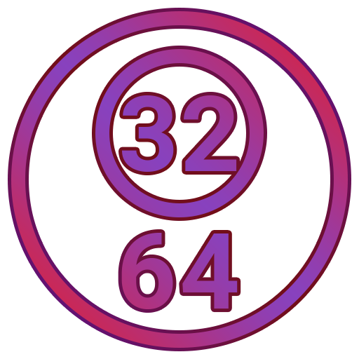

# I32O64B (Is 32 or 64 Bit OS)

This software is designed to know if you are on a 32 or 64 Bits Windows OS.

You can download latest version [here](https://github.com/GGLinnk/I32O64/releases/latest).
